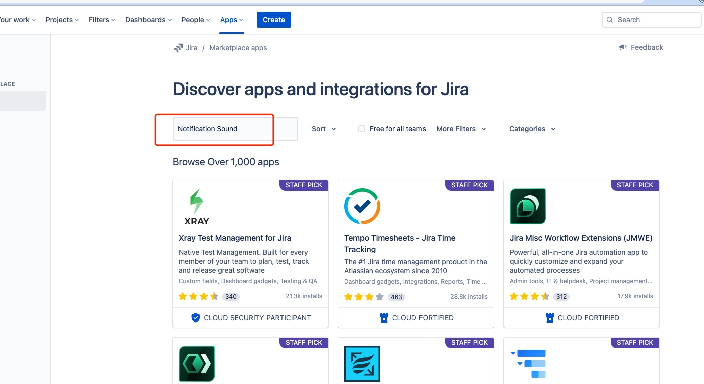

# Noti Sound Jira App

The whole purpose of this project is play a sound when a new ticket is created.

## Steps to setup

### Install this app from your Jira Marketplace:

### Search in the market place:

## Data Privacy Policy
See [Privacy Policy](./docs/PrivacyPolicy.md) for more details.

## Support
See [Get help](mailto:support@sysbox.com.au) for how to get help and provide feedback.

## Buy us a coffee
Like this app? can buy us a coffee [Here](https://www.buymeacoffee.com/sysbox).
